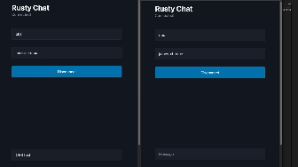

# Rusty Chatroom on Cloudflare



Sample application demonstrating using Rust alongside the full suite of Cloudflare serverless technologies.

## Usage

The front-end application exposes two pages:

- `/`: The chatroom interface
- `/chats`: Create new chats, join existing chats

All chats are password protected. Chat metadata (name, password etc) are stored in a D1 database.

Once you have created a chat, you will be redirected to the `/` interface. The relevant `chat_id` is set in your browser local storage. Enter a username, and the correct password, and you will be connected to the chat. Perform this action in multiple different browser windows to use the chat.

## Prerequisites

- [Rust](https://www.rust-lang.org/tools/install)
- [Wrangler CLI](https://developers.cloudflare.com/workers/wrangler/install-and-update/)
- [NPM](https://docs.npmjs.com/downloading-and-installing-node-js-and-npm)

## Local Development

Wrangler, the Cloudflare CLI, packages the ability to run local development environments. To run the chat application locally, you'll need **two seperate** terminal windows, and the below CLI commands.

### Terminal Window 1

In the first terminal window, you will start up the local instance of the chat application backend. The backend uses Workers, D1, KV and Durable Objects to provide chatroom functionality.

```sh
cd src/backend
npx wrangler d1 migrations apply rusty-serverless-chat-metadata --local
npx wrangler dev
```

### Terminal Window 2

In the second terminal window, you will start up the front-end application.

```sh
cd src
npm run dev
```

The `dev` script starts up a local instance of Cloudflare pages on port 8080. It also passes in the `--service` flag which bings the worker inside the pages, to your backend worker that is also running locally.

Navigate to [http://localhost:8080](http://localhost:8080/chats) to interact with the chat application.

## Deploy to Cloudflare

This sample application uses Durable Objects, which are only available in a [Workers paid plan](https://developers.cloudflare.com/workers/platform/pricing/#workers). Ensure you have at least a paid plan before continuing.

The KV namespace and D1 database are deployed using Terraform. You will first need to create a file named `dev.tfvars` inside the [src/infra](/src/infra/) directory. Populate with your Cloudflare API key and account id.

```
cloudflare_api_token=""
cloudflare_account_id = ""
```

Then run the below commands to deploy your infrastructure

```sh
cd src/infra
terraform apply
```

Once created, the KV binding ID and D1 database ID will be output to your console. The final step, is to update the [`wrangler.toml`](/src/backend/wrangler.toml) file with the `database_id` and kv_namespace `id`.
```toml
[[d1_databases]]
binding = "CHAT_METADATA"
database_id = "" # Database ID goes here
database_name = "rusty-serverless-chat-metadata"

[[kv_namespaces]]
binding = "CHAT_HISTORY"
id = "" # KV namespace ID goes here
```

Then run the below commands

```sh
cd src backend
npx wrangler d1 migrations apply rusty-serverless-chat-metadata --remote
npx wrangler deploy
cd ..
npx wrangler pages deploy
```

## Troubleshooting

### Unable to build for wasm32-unknown-unknown

Apple Clang is a forked version of Clang specific to the Apple ecosystem. It does not provide support for `wasm32-unknown-unknown`. To compile, you need to install `llvm.org` Clang instead of the Apple package one. Instructions can be found in [this GitHub issue](https://github.com/briansmith/ring/issues/1824).